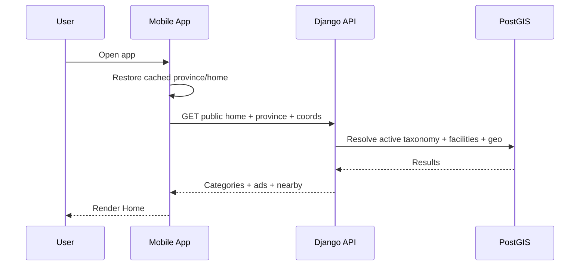
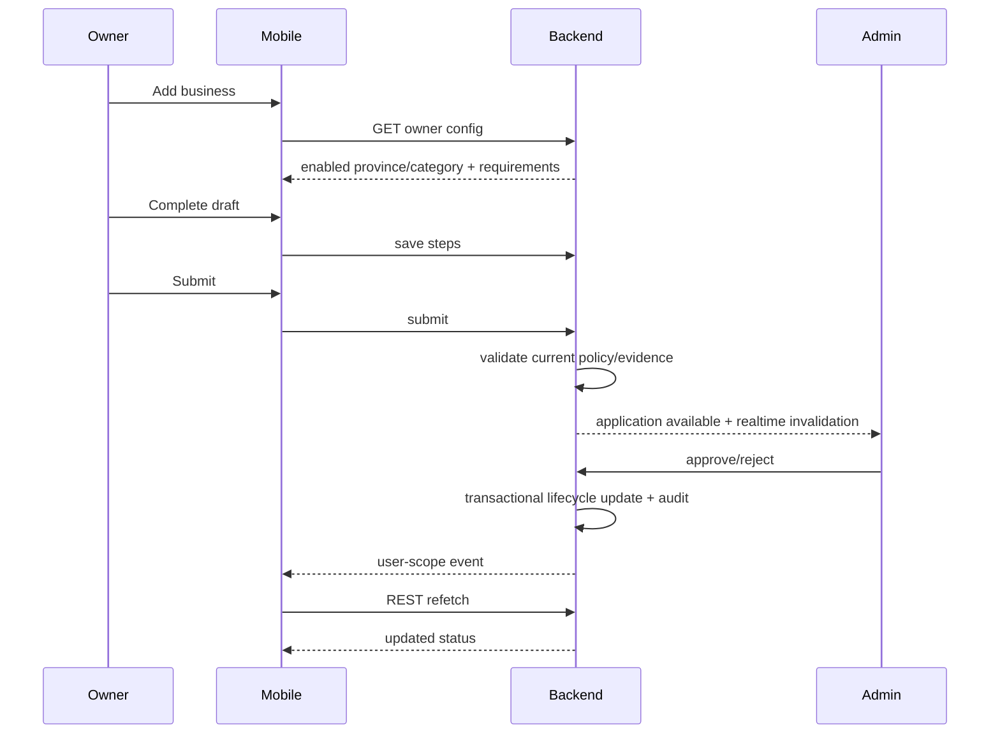

# Operating Cycles and End-to-End Relationships

هذه الوثيقة تشرح الدورة التشغيلية حتى يفهم أي منفذ علاقة التطبيق والـAdmin والـBackend معًا.

## Cycle A — Public discovery



Rules:
- cache improves startup but server owns truth.
- no fake facilities if API empty.
- GPS is optional.

## Cycle B — Search

```text
User types
→ debounce
→ request with province + query + optional coords
→ backend normalizes query
→ database/search indexes
→ results
→ client renders/paginates
```

If query returns 0:
- show useful zero state.
- optionally log `search_zero_results`.
- do not fabricate suggested facility.

## Cycle C — Location

```text
Launch
→ cached selection
→ permission state
→ native foreground location
→ coordinates
→ backend distance order
```

If denied:
```text
manual province
→ public directory works
→ distance null
```

## Cycle D — Registration/session

```text
Phone + name + province
→ OTP challenge
→ OTP verify
→ password
→ create user
→ create session
→ access token + refresh material
→ refresh stored securely
```

Refresh:
```text
access expires
→ refresh request
→ rotate secret
→ update secure store
```

Compromise/reuse:
```text
invalid reuse
→ revoke session
→ require login
```

## Cycle E — Owner onboarding



## Cycle F — Admin review

Reviewer sees:
- application.
- facility.
- map.
- public images.
- private evidence.
- checklist.
- warnings.
- history.

Approve transaction:
```text
lock application/facility
→ recheck state
→ recheck requirements
→ update application
→ update facility lifecycle
→ audit
→ commit
→ emit event after commit
```

Reject:
- reason required.
- no silent deletion.

## Cycle G — Active facility sensitive edit

```text
ACTIVE
→ owner edits sensitive field
→ backend saves pending/current strategy
→ facility enters REVERIFICATION_REQUIRED
→ admin reviews change diff
→ approve
→ ACTIVE
```

Suspended facility cannot self-reactivate through this path.

## Cycle H — Hours/availability

```text
weekly schedule
+ current Damascus time
+ temporary closure
+ duty
→ availability engine
→ TEMP_CLOSED / DUTY / OPEN / CLOSED
```

No cron job flips `is_open_now`.

## Cycle I — Duty

```text
owner creates duty
→ DB validates no overlap
→ commit
→ province/facility invalidation
→ public app refetch
→ pharmacy appears in Duty Now
```

Temporary closure always wins.

## Cycle J — Category activation

```text
Admin creates/configures category
→ capabilities
→ verification policy
→ province switches
→ commit
→ invalidate taxonomy cache
→ realtime public invalidation
→ clients refetch
```

GENERIC category should not require new APK.

## Cycle K — Advertisement

```text
Admin creates ad
→ image upload/validation
→ targeting/schedule
→ preview
→ activate
→ public API filters by time/scope
→ Home renders
→ analytics impression/click optional
```

## Cycle L — Realtime

```text
DB transaction
→ commit
→ sanitized event
→ WebSocket subscribers
→ cache invalidation
→ REST refetch
```

WebSocket is never the only source of an entity.

## Cycle M — Push

```text
business event
→ notification record/task
→ provider
→ FCM/APNs
→ device
→ deep link
→ REST fetch
```

Do not embed sensitive entity data in push body.

## Cycle N — Account deletion

```text
User requests deletion in app/web
→ identity confirmation
→ check ownership obligations
→ execute deletion/anonymization policy
→ revoke sessions
→ purge private profile media
→ retain only legally/security-required records
→ confirmation
```

## Cycle O — Release

```text
code complete
→ tests
→ security
→ staging
→ golden path
→ backup restore
→ build signed AAB
→ Play internal/closed testing
→ policy forms
→ production rollout
→ monitoring
```

## Cycle P — Incident

```text
alert
→ acknowledge
→ assess severity
→ mitigate
→ rollback/disable feature
→ recover
→ verify
→ postmortem
→ corrective action
```
