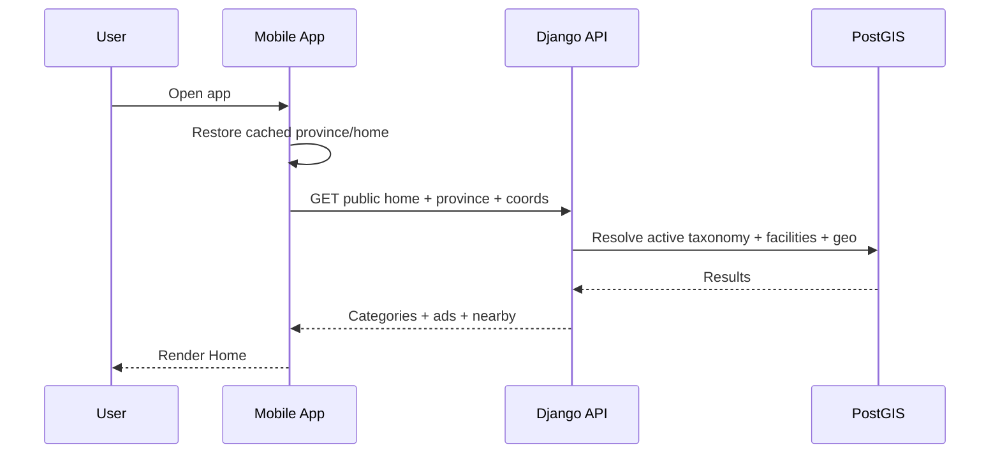
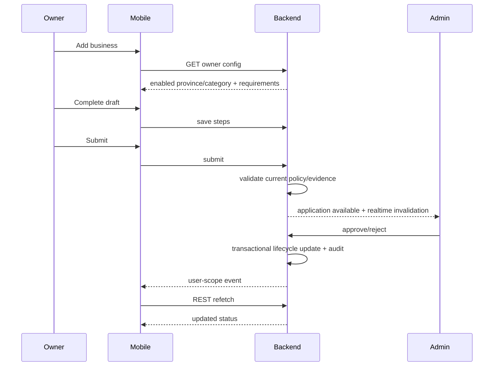

# SERVA CODE DIRECTORY PLATFORM V3 — COMPLETE HANDOFF

هذه النسخة المجمعة تحتوي جميع وثائق الحزمة بالترتيب.


---

# FILE: 00-START-HERE.md

# Serva Code Directory Platform V3 — START HERE

هذه الحزمة هي مرجع مستقل وكامل لبناء المشروع من الصفر حتى Staging وProduction والنشر على Google Play ثم iOS لاحقًا.

## قاعدة التنفيذ

أي مطور أو وكيل برمجي مثل Claude يجب أن:

1. يقرأ **كل الملفات في هذه الحزمة** قبل كتابة الكود.
2. يعتبر `01-MASTER-SPECIFICATION.md` المرجع الأعلى.
3. يقرأ `02-BASELINE-DECISIONS.md` حتى لا يسأل عن قرارات حُسمت.
4. ينشئ المشروع من الصفر وفق `26-REPOSITORY-STRUCTURE.md`.
5. ينفذ بالتسلسل وفق `24-IMPLEMENTATION-ROADMAP.md`.
6. بعد نجاح Gate ينتقل تلقائيًا إلى المرحلة التالية دون انتظار "التالي".
7. لا يستخدم React Native أو Flutter.
8. لا يختلق بيانات أو APIs أو صلاحيات غير موجودة في المواصفات.
9. لا يطبع أو يسجل الأسرار.
10. لا يعلن نجاح مرحلة بلا دليل تشغيل واختبارات.

## الهدف التقني النهائي

```text
Backend              Python + Django + DRF + GeoDjango
Database             PostgreSQL + PostGIS
Cache/Realtime       Redis + Django Channels
Async jobs           Celery
Admin Web            Next.js + React + TypeScript
Public Web           Next.js (legal/support/account deletion/landing)
Android              Kotlin + Jetpack Compose
iOS                  Swift + SwiftUI
Maps                 MapLibre Native
Routing              RoutingProvider → OSRM initially
Geocoding            GeocodingProvider
API Contracts        OpenAPI generated clients
Object storage       S3-compatible
DNS/CDN              Cloudflare recommended baseline
Staging/Production   Managed paid hosting, Render baseline
Monitoring           Sentry + structured server logs
```

## القرارات التي لا يجب إعادة فتحها أثناء التنفيذ

- المنتج category-driven وليس Pharmacy hardcoded.
- الحساب generic ويمكنه امتلاك عدة منشآت.
- public browsing لا يحتاج تسجيل دخول.
- rating/owner actions تحتاج login.
- PostGIS مصدر المسافة والـgeo.
- REST مصدر الحقيقة.
- WebSocket للأحداث/invalidation.
- Verification Evidence خاص ولا يظهر للعامة.
- Django Admin ليس لوحة التشغيل.
- Android Native Kotlin.
- iOS Native Swift.
- Design System موحد.
- العربية RTL هي اللغة الأساسية.
- Raqqa + Pharmacy + Duty هو launch baseline الأول.
- لا fake production data.
- لا demo map services في Production.

## عناصر خارجية لا يمكن اختراعها

الوثائق لا تطلب قرارات منتج إضافية، لكن بعض الأمور تحتاج ملكية/credentials حقيقية عند لحظة الربط:

- اسم النطاق الذي تم شراؤه.
- صلاحيات DNS/Cloudflare.
- Play Console account access.
- Firebase/APNs credentials.
- Production OTP provider credentials.
- Object storage keys.
- Sentry/monitoring credentials.
- Production secrets.
- Android upload keystore secret.

يجب على الوكيل تنفيذ كل ما يمكن محليًا وStaging تلقائيًا، ووضع هذه القيم خلف environment variables. عدم وجود credential خارجي **ليس سببًا لإيقاف بناء المشروع أو سؤال المستخدم عن المعمارية**.

## ترتيب القراءة المقترح

```text
01 Master Specification
02 Baseline Decisions
03 Product Specification
04 Operating Cycles
05 System Architecture
06 Data Model
07 Backend
08 API Contract
09 Admin
10 Design System
11 Android
12 iOS
13 Maps/Geo
14 Realtime/Offline/Push
15 Security/Privacy
16 Ads/Analytics/Audit
17 Testing/QA
18 Infrastructure
19 Domain/DNS/TLS
20 Google Play Release
21 App Store Release
22 Operations
23 Autonomous Claude Execution
24 Roadmap/Gates
25 Environment Contract
26 Repository Structure
27 Legacy/Migration
28 External Prerequisites
```

## حالة الوثائق

هذه الحزمة صممت لتكون **Implementation Baseline**.  
أي تغيير جوهري بعد اعتمادها يمر عبر ADR/Change Request بدل تعديلات صامتة.


---

# FILE: 01-MASTER-SPECIFICATION.md

# Serva Code Directory Platform V3 — Master Specification

**Document ID:** SCDP-V3-MASTER  
**Status:** IMPLEMENTATION BASELINE DRAFT  
**Owner:** Serva Code  
**Primary language:** Arabic RTL  
**Architecture:** Native mobile + Django platform  
**Launch:** Raqqa first, Syria-wide architecture

---

## 1. الرؤية

إنشاء منصة دليل سورية حديثة وموثوقة لاكتشاف المنشآت والخدمات حسب المحافظة والتصنيف والموقع، مع خرائط Native، ترتيب الأقرب، حالات الفتح والمناوبة، وإدارة احترافية لانضمام أصحاب المنشآت ومراجعتها.

المنصة ليست تطبيق صيدليات فقط. الصيدلية هي أول تصنيف تشغيلي. البنية نفسها يجب أن تستوعب لاحقًا العيادات، التمريض، المختبرات، المستلزمات الطبية، ثم تصنيفات خدمية وتجارية بدون إعادة كتابة التطبيق عند كل تصنيف عادي.

---

## 2. المنتجات التي تتكون منها المنصة

```text
1. Backend Platform
2. Custom Admin Web
3. Public/Owner Android App
4. Public/Owner iOS App
5. Minimal Public Web
```

### Backend Platform
مصدر الحقيقة للقواعد والبيانات والصلاحيات والـgeo والـsearch والـrealtime.

### Admin
لوحة تشغيل للموظفين، وليست مجرد CRUD.

### Android
Kotlin + Compose Native.

### iOS
Swift + SwiftUI Native.

### Public Web
صفحات عامة مطلوبة للتشغيل والنشر:
- landing.
- privacy.
- terms.
- support.
- account deletion request.

---

## 3. إطلاق V3 الأول

- المحافظة الفعالة: الرقة.
- التصنيف العام الفعال: الصيدليات.
- owner onboarding للصيدليات: فعال.
- pharmacy duty: فعال.
- كل المحافظات السورية موجودة بالقاعدة.
- المحافظات الأخرى: غير مفعلة.
- التصنيفات الأخرى: قابلة للإنشاء أو seed ولكن لا تظهر حتى تفعيلها.
- لا حاجة لحساب للتصفح العام.
- الحساب مطلوب للتقييم وإدارة المنشآت.

---

## 4. المستخدمون

### Anonymous
يستطيع:
- الرئيسية.
- التصنيفات.
- البحث.
- الخريطة.
- التفاصيل.
- الاتصال.
- الاتجاهات.
- المناوبات.

### Registered User
يضيف:
- الملف الشخصي.
- التقييم.
- الجلسات.
- بدء طلب إضافة منشأة.

### Facility Owner/Manager
يضيف:
- إنشاء/متابعة draft.
- إدارة منشآته.
- الصور.
- ساعات العمل.
- المناوبات.
- إعادة التحقق.
- المديرين ضمن السياسة.

### Admin Operator
حسب Permission Matrix.

---

## 5. تصنيف المنتج

الـtaxonomy ديناميكية:

```text
DirectoryCategoryGroup
DirectoryCategory
DirectoryCategoryProvince
CategoryCapabilities
VerificationRequirement
```

لا يُستخدم اسم التصنيف في if/else داخل Android/Admin لتمييز السلوك العادي.

### Technical specialization
يُستخدم فقط عند وجود منطق متخصص:

```text
GENERIC
PHARMACY
MEDICAL_CLINIC
NURSING_CENTER
```

---

## 6. التفعيل حسب المحافظة

Public visibility:

```text
province active
AND group active
AND category active
AND public_enabled for province
```

Owner onboarding:

```text
province active
AND group active
AND category active
AND owner_registration_enabled for province
```

المفتاحان مستقلان.

---

## 7. Capability-driven UX

أمثلة:

```text
Pharmacy:
  hours=true
  duty=true
  specialty=false
  service=false

Medical Clinic:
  hours=true
  duty=false
  specialty=true

Nursing Center:
  hours=true
  duty=false
  service=true

Generic:
  hours=true
  photos=true
  ratings=true
  duty=false
  specialty=false
  service=false
```

كل كلاينت يعرض الفلاتر والحقول بناءً على capabilities من API.

---

## 8. نطاق Core

Core يشمل:

- accounts.
- OTP/recovery abstraction.
- sessions.
- provinces/cities/neighborhoods.
- categories/groups/capabilities.
- facilities.
- ownership.
- onboarding.
- verification evidence.
- public images.
- business hours.
- temporary closures.
- pharmacy duty.
- public discovery.
- search.
- geo.
- ratings.
- admin.
- ads.
- realtime invalidation.
- push.
- offline caching.
- analytics.
- audit.
- backup/restore.
- monitoring.
- Android.
- iOS.

---

## 9. خارج Core

لا يدخل دون Change Request:

- e-commerce.
- cart.
- payments.
- delivery.
- medical records.
- consultation.
- prescriptions.
- appointment booking.
- insurance.
- chat.
- social feed.
- text reviews.
- background tracking.

---

## 10. مبادئ المعمارية

- Modular Monolith وليس Microservices.
- Django هو API/domain platform.
- PostgreSQL/PostGIS هو data/geo truth.
- Redis مساعد وليس source of truth.
- WebSocket event/invalidation layer.
- Celery للـasync غير المعاملاتي.
- OpenAPI contract.
- generated clients.
- native mobile clients.
- custom Admin.
- platform-neutral design tokens.
- provider abstractions للخدمات الخارجية.
- no demo endpoints in Production.
- no fake data.

---

## 11. دورة جودة Serva Code

```text
Requirement
→ UX/Architecture
→ Plan
→ Implement
→ Unit tests
→ Integration
→ Connected qualification
→ Device/Browser QA
→ Staging
→ Evidence
→ Close
```

---

## 12. Definition of Done العامة

الميزة لا تنتهي قبل وجود:

- spec.
- implementation.
- loading state.
- empty state.
- error state.
- offline/permission state عند الحاجة.
- security review حسب المخاطر.
- tests.
- accessibility.
- analytics إن كانت مطلوبة.
- documentation.
- evidence.
- no P0/P1.

---

## 13. الهدف النهائي

الإطلاق الإنتاجي يجب أن يملك:

```text
api.<ROOT_DOMAIN>
admin.<ROOT_DOMAIN>
www.<ROOT_DOMAIN>
```

مع:
- TLS.
- paid production compute.
- managed PostgreSQL/PostGIS.
- Redis.
- Celery worker.
- private object storage.
- monitoring.
- backups.
- restore proof.
- signed Android AAB.
- Play policy completion.
- privacy/account deletion URLs.
- staged production rollout.


---

# FILE: 02-BASELINE-DECISIONS.md

# Baseline Decisions — لا تسأل عن هذه القرارات أثناء التنفيذ

هذا الملف يحسم defaults حتى يستطيع وكيل برمجي بدء التنفيذ تلقائيًا.

## Product / naming

```text
Repository slug: directory-platform-v3
Internal product code: DIRECTORY
Development display name Arabic: الدليل
Development display name English: Directory
Android applicationId: com.servacode.directory
iOS bundle identifier: com.servacode.directory
Timezone: Asia/Damascus
Primary locale: ar
Secondary-ready locale: en
```

يمكن تغيير **الاسم الظاهر** قبل Store Listing بدون تغيير المعمارية. لا تغيّر `applicationId` بعد إنشاء Play production listing إلا بقرار صريح.

## Backend

```text
Language: Python 3.13
Framework: Django 5.2 LTS
API: Django REST Framework
Geo: GeoDjango/PostGIS
DB: PostgreSQL 17
Cache/broker: Redis
Async: Celery
Realtime: Django Channels
Schema: drf-spectacular OpenAPI
Password hasher: Argon2 first
Package management: uv + pyproject + lock
```

Django 5.2 LTS يفضل على feature release أحدث في البداية لأن الهدف هو استقرار طويل العمر.

## Web

```text
Node: 24.x
Package manager: pnpm
Admin: Next.js + React + TypeScript strict
Public web: Next.js
Styling: Tailwind CSS + Serva Design System
Accessible primitives: Radix where useful
Unit: Vitest
E2E: Playwright
```

## Android

```text
Kotlin Native
Jetpack Compose
minSdk: 24
targetSdk: 36
compileSdk: 36 (or higher compatible stable without changing target policy)
Architecture: feature modular + UDF/MVVM
DI: Hilt
Network: Retrofit + OkHttp
Serialization: Kotlin Serialization
Cache: Room
Preferences: DataStore
Secrets: Android Keystore-backed secure store
Maps: MapLibre Native
Location: native fused/location implementation behind LocationProvider
Push: FCM
Images: Coil
```

As of 2026-09-17 Google Play requires new apps/updates submitted after 2026-08-31 to target Android 16 / API 36 or higher.

## iOS

```text
Swift + SwiftUI
async/await
URLSession/generated OpenAPI client
Keychain
SwiftData baseline unless ADR finds a blocker
Core Location
MapLibre Native
APNs
```

## Design

```text
Direction: Arabic RTL, clean, professional, Syrian-modern without political decoration
Primary: #0B6B47
Primary strong: #06452F
Primary soft: #DCEFE6
Background: #F7F8F5
Surface: #FFFFFF
Text primary: #15231C
Text secondary: #5D6B64
Border: #DDE4E0
Success: #138A5B
Warning: #C98214
Danger: #C23B3B
Info: #2E6FB5
Font baseline: Tajawal
```

Exact accessibility variants may adjust during Design System validation.

## Production baseline infrastructure

```text
DNS: Cloudflare
Public web: Render paid Web Service
Admin: Render paid Web Service
API: Render paid ASGI Web Service
Worker: Render paid background worker
DB: Render managed PostgreSQL 17 + PostGIS
Redis: Render managed Key Value / Redis-compatible paid service
Object storage: Cloudflare R2 (S3-compatible) baseline
Monitoring: Sentry baseline
Region: Frankfurt/closest reliable supported region baseline
```

Provider abstractions prevent lock-in.

## Production domain convention

The actual root domain is an external owned asset and cannot be invented.

Code must use:

```text
ROOT_DOMAIN=<owned-domain>

www.<ROOT_DOMAIN>
api.<ROOT_DOMAIN>
admin.<ROOT_DOMAIN>
```

Optional:
```text
cdn.<ROOT_DOMAIN>
status.<ROOT_DOMAIN>
```

No code may hardcode a provider-generated Render hostname as Production identity.

## Maps / routing / geocoding

```text
Renderer: MapLibre
Nearby: backend/PostGIS
Routing interface: RoutingProvider
Initial routing implementation: OSRM
Geocoding interface: GeocodingProvider
Development geocoder: Nominatim-compatible
Production provider/hosting: configurable, never public demo endpoint by assumption
```

## Auth

Use:
- short-lived access token.
- opaque rotating refresh secret.
- session table.
- reuse detection.
- revoke current/all.
- password change revokes all.
- blocked user rejected.

Access-token wire standard should use standard JOSE/JWT or a well-reviewed signed format. Do not invent cryptography.

## Public data

No account required for browsing/search/map/details/directions/duty.

## Account creation

Baseline:
```text
name
Syrian mobile
province
OTP verification
password
```

Supported input:
```text
09xxxxxxxx
+9639xxxxxxxx
009639xxxxxxxx
```

Canonical:
```text
+9639xxxxxxxx
```

## Owner verification

Public images != private evidence.

Default generic verification policy can start with:
- storefront/sign photo.
- business card/photo proof.

But requirements are Admin-configurable and not hardcoded into clients.

## Release behavior

- Android first.
- iOS begins after contracts/design are stable and Android core is device-qualified.
- Production rollout is staged.
- No production claim without backup restore proof and monitoring.


---

# FILE: 03-PRODUCT-SPECIFICATION.md

# Product Specification

## 1. Home

Top:
- current location/province.
- location state/refresh action.
- search icon.

Content:
- advertisement slider.
- main category grid.
- nearby section.
- chips: All / Open Now / Duty Now when relevant.
- facility cards.

Bottom navigation:
- Home.
- Map.
- Account.

No Search bottom tab.

## 2. Province and location

Behavior:
- restore last selected province immediately.
- attempt foreground location automatically where permission exists.
- do not block app startup.
- if precise coordinates exist, use them for nearest ordering.
- if only approximate coordinates exist, do not claim exact precision.
- if permission denied, manual province remains fully usable.

Province selection and current GPS are related but not identical:
- selected province determines directory scope.
- coordinates determine distance/order.
- backend may map coordinates to a province if trusted polygon/reference data exists.
- never silently switch province against explicit user selection without clear UX.

## 3. Categories

Categories come from API.

Category grid uses:
- name.
- iconKey.
- order.
- capabilities.

Click opens generic directory screen with categoryId.

## 4. Directory list

Filters are capability-driven.

Always possible:
- category.
- province.

Optional:
- nearest.
- open now.
- duty now.
- specialty.
- service.
- city/neighborhood.
- text search.

General category list is province-wide. Do not cut by a hidden small radius.

## 5. Search

Search entry is available from Home top bar.

Search:
- debounced.
- cancellable.
- paginated/cursor-based.
- supports zero-result state.
- stores recent searches locally only if product privacy policy permits.
- can search facility, category, location, specialty/service.

## 6. Facility details

Public:
- image gallery.
- Arabic name.
- optional English name.
- category.
- state.
- distance when known.
- rating average/count.
- address.
- city/neighborhood.
- phone.
- map.
- directions.
- hours.
- next open.
- specialty/services.
- category-specific public profile.
- rating action if logged in.

Private/internal must never leak:
- evidence.
- reviewer notes.
- memberships unless owner/admin.
- internal specialization policy fields.
- raw storage keys.
- audit.

## 7. Ratings

- login required.
- 1 to 5.
- one rating per user/facility.
- editable.
- delete optional; baseline allowed.
- no text reviews.
- own facility member cannot rate.
- public DTO exposes aggregate only.

## 8. Account

Sections:
- profile.
- selected/profile province.
- profile image.
- my ratings.
- my facilities.
- sessions/devices.
- settings.
- privacy.
- request account deletion.
- logout.

## 9. Register

Flow:
1. name.
2. mobile.
3. province.
4. OTP.
5. password.
6. success/session.

No business type attached to account.

## 10. Recovery

- mobile.
- OTP/link through provider abstraction.
- new password only in app/web secure flow.
- successful reset revokes sessions.

## 11. Owner: My Facilities

Show:
- facility name.
- category.
- province.
- lifecycle state.
- last update.
- required action.

Actions depend on state.

## 12. Owner onboarding

Steps:
1. province/category.
2. basic info.
3. map point.
4. hours.
5. public images.
6. specialized fields.
7. verification evidence.
8. review.
9. submit.
10. status.

Draft auto-save.

If onboarding later disables:
- existing draft can be edited.
- submit/re-submit rechecks current policy.

## 13. Active facility management

Owner may:
- edit info.
- edit contact.
- edit location.
- edit images.
- edit hours.
- create/cancel temporary closure.
- duty actions.
- managers.

Sensitive edits cause REVERIFICATION_REQUIRED.

## 14. Pharmacy duty

Owner:
- schedule future shift.
- start now if valid.
- edit according to policy.
- cancel.
- end early.

Public:
- Duty Now.
- temporary closure overrides.

## 15. Admin

Admin is task-oriented.

Core modules:
- Dashboard.
- Applications.
- Facilities.
- Users.
- Roles.
- Provinces.
- Category Groups.
- Categories.
- Capabilities.
- Verification Policies.
- Ads.
- Audit.
- Analytics.
- Settings.
- System Status.

## 16. Ads

Home ads can be:
- global.
- province-targeted.
- optionally category-contextual.
- scheduled.
- ordered.
- duration-controlled.
- clickable to safe destinations.

## 17. Maintenance

Admin can enable typed maintenance settings.

Mobile behavior:
- receive API maintenance response.
- show branded maintenance screen.
- retry.
- no crash loop.

## 18. Public web

Minimum pages:
- `/`
- `/privacy`
- `/terms`
- `/support`
- `/delete-account`

Optional future:
- public facility pages.
- SEO directory.

## 19. Account deletion

Because account creation exists, provide:
- in-app path.
- external web path.
- authenticated or identity-confirmed request.
- data deletion/anonymization rules.
- retention exceptions explained.

## 20. Product exclusions

Do not add:
- appointments.
- ordering.
- delivery.
- payments.
- patient records.
- chat.
without approved Change Request.


---

# FILE: 04-OPERATING-CYCLES.md

# Operating Cycles and End-to-End Relationships

هذه الوثيقة تشرح الدورة التشغيلية حتى يفهم أي منفذ علاقة التطبيق والـAdmin والـBackend معًا.

## Cycle A — Public discovery



Rules:
- cache improves startup but server owns truth.
- no fake facilities if API empty.
- GPS is optional.

## Cycle B — Search

```text
User types
→ debounce
→ request with province + query + optional coords
→ backend normalizes query
→ database/search indexes
→ results
→ client renders/paginates
```

If query returns 0:
- show useful zero state.
- optionally log `search_zero_results`.
- do not fabricate suggested facility.

## Cycle C — Location

```text
Launch
→ cached selection
→ permission state
→ native foreground location
→ coordinates
→ backend distance order
```

If denied:
```text
manual province
→ public directory works
→ distance null
```

## Cycle D — Registration/session

```text
Phone + name + province
→ OTP challenge
→ OTP verify
→ password
→ create user
→ create session
→ access token + refresh material
→ refresh stored securely
```

Refresh:
```text
access expires
→ refresh request
→ rotate secret
→ update secure store
```

Compromise/reuse:
```text
invalid reuse
→ revoke session
→ require login
```

## Cycle E — Owner onboarding



## Cycle F — Admin review

Reviewer sees:
- application.
- facility.
- map.
- public images.
- private evidence.
- checklist.
- warnings.
- history.

Approve transaction:
```text
lock application/facility
→ recheck state
→ recheck requirements
→ update application
→ update facility lifecycle
→ audit
→ commit
→ emit event after commit
```

Reject:
- reason required.
- no silent deletion.

## Cycle G — Active facility sensitive edit

```text
ACTIVE
→ owner edits sensitive field
→ backend saves pending/current strategy
→ facility enters REVERIFICATION_REQUIRED
→ admin reviews change diff
→ approve
→ ACTIVE
```

Suspended facility cannot self-reactivate through this path.

## Cycle H — Hours/availability

```text
weekly schedule
+ current Damascus time
+ temporary closure
+ duty
→ availability engine
→ TEMP_CLOSED / DUTY / OPEN / CLOSED
```

No cron job flips `is_open_now`.

## Cycle I — Duty

```text
owner creates duty
→ DB validates no overlap
→ commit
→ province/facility invalidation
→ public app refetch
→ pharmacy appears in Duty Now
```

Temporary closure always wins.

## Cycle J — Category activation

```text
Admin creates/configures category
→ capabilities
→ verification policy
→ province switches
→ commit
→ invalidate taxonomy cache
→ realtime public invalidation
→ clients refetch
```

GENERIC category should not require new APK.

## Cycle K — Advertisement

```text
Admin creates ad
→ image upload/validation
→ targeting/schedule
→ preview
→ activate
→ public API filters by time/scope
→ Home renders
→ analytics impression/click optional
```

## Cycle L — Realtime

```text
DB transaction
→ commit
→ sanitized event
→ WebSocket subscribers
→ cache invalidation
→ REST refetch
```

WebSocket is never the only source of an entity.

## Cycle M — Push

```text
business event
→ notification record/task
→ provider
→ FCM/APNs
→ device
→ deep link
→ REST fetch
```

Do not embed sensitive entity data in push body.

## Cycle N — Account deletion

```text
User requests deletion in app/web
→ identity confirmation
→ check ownership obligations
→ execute deletion/anonymization policy
→ revoke sessions
→ purge private profile media
→ retain only legally/security-required records
→ confirmation
```

## Cycle O — Release

```text
code complete
→ tests
→ security
→ staging
→ golden path
→ backup restore
→ build signed AAB
→ Play internal/closed testing
→ policy forms
→ production rollout
→ monitoring
```

## Cycle P — Incident

```text
alert
→ acknowledge
→ assess severity
→ mitigate
→ rollback/disable feature
→ recover
→ verify
→ postmortem
→ corrective action
```


---

# FILE: 05-SYSTEM-ARCHITECTURE.md

# System Architecture

## 1. Architecture style

Use a modular monolith.

Reason:
- product is one bounded platform.
- simpler transaction integrity.
- easier deployment and debugging.
- enough scalability for initial and medium scale.
- prevents premature microservice complexity.

Split services only after measured operational need.

## 2. Backend boundaries

```text
core
accounts
sessions
locations
directory
facilities
ownership
verification
business_hours
pharmacy_duty
ratings
media_storage
search
realtime
notifications
ads
analytics
audit
platform_settings
admin_console
health
```

## 3. Read/write layering

Recommended:

```text
HTTP View
→ Serializer / Request DTO
→ Permission
→ Service
→ Model/DB
```

Complex reads:

```text
View
→ Selector/Query Service
→ ORM/PostGIS
```

Do not place complex lifecycle logic in serializer `.save()` or views.

## 4. Transactions

Use `transaction.atomic()` for:
- application submit.
- review approve/reject.
- membership changes.
- duty mutations.
- sensitive state transitions.
- settings mutations tied to audit.

External effects after commit:
- WebSocket.
- push queue.
- cache invalidation.

## 5. Cache

Redis:
- public taxonomy cache.
- rate limiting.
- WebSocket layer.
- Celery broker/result where needed.
- selective response fragments.

Database remains authoritative.

## 6. ASGI

Django runs ASGI because:
- REST.
- WebSocket.
- async-compatible edges.

Do not convert all DB services to async merely because ASGI exists.

## 7. Public/owner/admin API separation

Public DTOs are privacy-minimal.

Owner:
- member-scoped.

Admin:
- permission-scoped.

No shared “full facility serializer” exposed to all three.

## 8. Public Web architecture

`apps/web`:
- landing.
- legal.
- support.
- deletion request.
- future public SEO.

It can call public/account deletion endpoints but should not become Admin.

## 9. Admin BFF

Admin Next.js uses same-origin server routes/BFF for browser session refresh cookie.

Browser:
```text
admin.<domain>
→ Next.js
→ backend API
```

Avoid exposing refresh token to JS.

## 10. Mobile architecture

Mobile calls `api.<domain>` directly over HTTPS.

Secrets stored using platform secure storage.

## 11. Contract generation

Django OpenAPI is generated during CI.

Clients generated:
- TS.
- Kotlin.
- Swift.

Schema hash committed/verified.

## 12. Provider interfaces

External dependencies behind interfaces:

```text
OtpProvider
RecoveryProvider
PushProvider
ObjectStorageProvider
RoutingProvider
GeocodingProvider
MapStyleProvider
AnalyticsProvider
ObservabilityProvider
```

## 13. Failure philosophy

- DB failure → readiness false.
- Redis failure → degrade only where safe; auth/session policies that require Redis must fail safely.
- Celery down → queue persists/retries if broker works; critical transaction still committed.
- push failure → do not rollback business action.
- analytics failure → do not block product.
- map routing failure → external map fallback.
- geocoder failure → manual map pin still possible.

## 14. Versioning

API:
```text
/api/v1/
```

Breaking changes use new version or compatibility window.

Mobile version support window documented with each release.

## 15. Security boundaries

Trust:
- device/browser untrusted.
- client IDs/params untrusted.
- object-storage paths private by default.
- Admin UI permission display is convenience, backend is enforcement.


---

# FILE: 06-DATA-MODEL.md

# Data Model and Constraints

Use UUID primary keys for externally visible domain entities.

## User
Fields:
- id UUID.
- phone canonical unique.
- display_name.
- profile_province FK.
- status.
- phone_verified_at.
- profile_image_key private nullable.
- created_at.
- updated_at.

Indexes:
- unique normalized phone.
- status.
- profile province.

## UserSession
Fields:
- id.
- user.
- refresh_digest.
- previous_refresh_digest.
- previous_valid_until.
- platform.
- device_name.
- created_at.
- last_seen_at.
- revoked_at.
- compromised_at.

Indexes:
- user + revoked.
- last_seen.

## OTPChallenge
Fields:
- id.
- phone.
- purpose.
- otp_digest.
- attempt_count.
- max_attempts.
- expires_at.
- consumed_at.
- created_at.

No raw OTP storage.

## Province
- id.
- code unique.
- name_ar.
- name_en.
- is_active.
- sort_order.
- geometry optional MultiPolygon.

## City
- id.
- province.
- name_ar/en.
- is_active.
- geometry optional.

## Neighborhood
- id.
- city.
- name_ar/en.
- is_active.
- geometry optional.

## DirectoryCategoryGroup
- id.
- slug unique.
- name_ar/en.
- icon_key nullable.
- is_active.
- sort_order.

## DirectoryCategory
- id.
- group.
- code unique immutable.
- slug unique immutable.
- name_ar/en.
- description_ar/en.
- icon_key.
- specialization.
- is_active.
- sort_order.

## DirectoryCategoryProvince
- category.
- province.
- public_enabled.
- owner_registration_enabled.
- sort_order.

Constraint unique(category, province).

## CategoryCapabilities
One-to-one category:
- supports_hours.
- supports_photos.
- supports_ratings.
- supports_duty.
- supports_specialty_filter.
- supports_service_filter.
- supports_temporary_closure.
- supports_owner_onboarding.

Invariant:
- supports_duty allowed only for approved specialization/policy.

## VerificationRequirement
- id.
- category.
- label_ar/en.
- instructions_ar/en.
- required.
- active.
- min_files >= 0.
- max_files >= min_files.
- sort_order.

## Specialty
- id.
- category or specialization scope.
- name_ar/en.
- active.
- sort_order.

## ServiceTag
- id.
- category.
- name_ar/en.
- active.
- sort_order.

## Facility
- id.
- category.
- province.
- city nullable.
- neighborhood nullable.
- name_ar.
- name_en.
- description_ar/en.
- phone.
- address_ar/en.
- location Point geography/geometry SRID 4326.
- status.
- activated_at.
- created_at.
- updated_at.

Indexes:
- category/status/province.
- city.
- GIST location.
- normalized searchable text strategy.

## FacilityMembership
- facility.
- user.
- role OWNER|MANAGER.
- created_at.

Unique facility/user.

Protect last owner.

## FacilityApplication
- id.
- facility.
- kind INITIAL|REVERIFICATION.
- status DRAFT|SUBMITTED|APPROVED|REJECTED.
- submitted_at.
- reviewed_at.
- reviewed_by.
- rejection_reason.
- snapshot/diff references if used.
- timestamps.

Only one active submitted application of applicable kind per facility.

## FacilityPublicImage
- id.
- facility.
- storage_key.
- sort_order.
- width/height.
- created_at.

Public API never returns raw storage key; returns protected public media route or CDN URL created by service.

## VerificationEvidence
- id.
- facility.
- requirement.
- storage_key.
- uploaded_by.
- created_at.

Private.

## BusinessHour
Recommended normalized:
- facility.
- weekday 0..6.
- sequence.
- start_time nullable.
- end_time nullable.
- is_24h.
- is_closed record strategy.

Validate:
- no same-day overlaps.
- overnight semantics.
- deterministic order.

## TemporaryClosure
- id.
- facility.
- starts_at.
- ends_at.
- reason.
- created_by.
- cancelled_at.

## PharmacyDutyShift
- id.
- facility.
- starts_at.
- ends_at.
- created_by.
- cancelled_at.
- ended_early_at.

Use PostgreSQL exclusion constraint/range to prevent overlapping effective shifts for same facility.

## Rating
- id.
- user.
- facility.
- stars CHECK 1..5.
- timestamps.

Unique(user, facility).

## Advertisement
- id.
- image_key.
- title_ar/en optional.
- subtitle_ar/en optional.
- action_type.
- action_payload validated.
- target_scope GLOBAL|PROVINCE|CATEGORY.
- province nullable.
- category nullable.
- starts_at.
- ends_at.
- enabled.
- sort_order.
- slide_duration_ms bounded.
- timestamps.

## Notification
- id.
- user.
- type.
- payload safe JSON.
- read_at.
- created_at.

## DevicePushToken
- id.
- user/session.
- platform.
- token encrypted or protected.
- active.
- last_seen.
- created_at.

## PlatformSetting
Typed setting:
- key.
- type.
- serialized value.
- updated_by.
- timestamps.

## AuditLog
- id.
- actor.
- action.
- resource_type.
- resource_id.
- before_snapshot redacted.
- after_snapshot redacted.
- request_id.
- metadata redacted.
- created_at.

Append-oriented.

## SearchAnalytics / ProductAnalytics
Prefer aggregated/event pipeline with privacy minimization rather than coupling core DB to analytics forever.

## AccountDeletionRequest
- id.
- user nullable.
- phone/email lookup information minimized.
- channel IN_APP|WEB.
- status.
- requested_at.
- verified_at.
- completed_at.
- retention_notes.
- audit linkage.

## Referential/lifecycle rules

- deleting province/category with referenced facilities should be disallowed; deactivate instead.
- evidence deletion policy depends on application lifecycle/retention.
- suspending facility removes it from public discovery.
- closed facility removes it unless archival public policy later added.
- inactive category/province removes public eligibility without deleting facility data.


---

# FILE: 07-BACKEND-DJANGO.md

# Backend Django Implementation Specification

## Bootstrap

Create:
```bash
uv init
uv add Django djangorestframework django-filter django-cors-headers drf-spectacular
uv add "channels[daphne]" channels-redis celery redis "psycopg[binary]" argon2-cffi Pillow "django-storages[s3]"
uv add --dev pytest pytest-django ruff mypy django-stubs
```

Pin exact resolved versions in lockfile.

## Settings split

```text
directory_backend/settings/
  base.py
  development.py
  test.py
  staging.py
  production.py
```

Production validation fails closed if required env vars missing.

## Django apps

Use domain modules listed in architecture.

Each app:
```text
models/
services/
selectors/
serializers/
views/
permissions/
urls.py
tests/
```

## Authentication

Implement custom authentication backend/API layer.

Do not use Django Admin as product UI.

Admin staff roles are domain roles, not a dependency on Django `is_staff` workflows.

## API documentation

drf-spectacular:
- schema.
- Swagger only in dev/staging privileged or disabled in prod per policy.
- operation IDs stable.
- enums explicit.
- error responses documented.

## Geo

Enable:
- `django.contrib.gis`.
- PostGIS extension migration.
- PointField.
- GIST indexes.

Query:
- annotate distance.
- order by distance when coords valid.
- bbox intersection/filter.
- province eligibility first.

## Search

Start with:
- normalized columns or expressions.
- PostgreSQL trigram/full-text where appropriate.
- indexes proven by EXPLAIN.

Do not install external search engine before metrics.

## Availability service

Central service:
```text
get_facility_availability(facility, now)
get_next_open(facility, now)
```

No duplicate logic in serializers/mobile.

## Owner services

Functions/tasks:
- create draft.
- update core.
- update location.
- replace hours.
- manage images.
- upload evidence.
- validate submission.
- submit.
- trigger reverification.
- manage duty.
- manage closure.
- membership.

Every service rechecks membership.

## Admin review service

Transactional approve/reject/suspend/reactivate.

Use `select_for_update` where concurrency matters.

## Media

Validation service:
- verify signature by decoding.
- size and pixel limits.
- re-encode.
- metadata strip.
- deterministic safe extension.
- private/public namespace.

## Realtime

Channels consumer authenticates after connect or via secure subprotocol/header mechanism supported by client/proxy.

Never put access token in URL query where logs may capture it.

## Celery

Tasks should be idempotent where practical.

Retry:
- push.
- outbound messages.
- analytics aggregation.
- media cleanup.

No async task decides transaction truth after response unless product explicitly accepts eventual consistency.

## Throttling

Implement central policies:
- login.
- OTP start.
- OTP verify.
- recovery.
- search abuse.
- uploads.
- admin sensitive endpoints.

Use trusted proxy-aware client IP rules.

## Health

`/health/live/`: process alive.
`/health/ready/`: DB and required runtime ready.

Runtime smoke command checks:
- PostGIS.
- Redis.
- Celery.
- object storage.

## Logging

JSON production logs:
- timestamp.
- level.
- requestId.
- route.
- status.
- duration.
- safe actor id.
- error code.

Never:
- password.
- OTP.
- access/refresh token.
- DB URL.
- storage secret.
- evidence path if sensitive.

## Tests

Backend minimum:
- domain rules.
- permissions.
- IDOR.
- lifecycle.
- concurrency.
- PostGIS.
- media privacy.
- duty overlap.
- availability.
- account/session.
- admin.
- OpenAPI.


---

# FILE: 08-API-CONTRACT.md

# API Contract Specification

Base:
```text
/api/v1/
```

## Conventions

JSON:
- camelCase at API boundary baseline.
- backend internal Python snake_case.
- one convention only.

Dates:
- ISO-8601 UTC timestamps.

IDs:
- UUID strings.

Coordinates:
```json
{"latitude":35.95,"longitude":39.01}
```

Error:
```json
{
  "code": "VALIDATION_ERROR",
  "message": "تعذر حفظ البيانات.",
  "details": {
    "phone": ["INVALID_PHONE"]
  },
  "requestId": "..."
}
```

Clients branch on `code`.

## Public

### GET `/public/provinces/`
Returns active public province metadata.

### GET `/public/provinces/{provinceId}/cities/`

### GET `/public/provinces/{provinceId}/categories/`
Safe category + capabilities only.

Example:
```json
{
  "items": [
    {
      "id": "...",
      "nameAr": "صيدليات",
      "nameEn": "Pharmacies",
      "iconKey": "pharmacy",
      "capabilities": {
        "hours": true,
        "ratings": true,
        "duty": true,
        "specialtyFilter": false,
        "serviceFilter": false
      }
    }
  ]
}
```

### GET `/public/home/`
Query:
```text
provinceId
latitude?
longitude?
```

Returns:
- ads.
- categories.
- nearby.
- openNearby.
- dutyNow if relevant.
- serverTime.

### GET `/public/facilities/`
Query:
```text
provinceId required
categoryId required
latitude?
longitude?
cityId?
neighborhoodId?
openNow?
dutyNow?
specialtyId?
serviceId?
search?
cursor?
limit?
```

### GET `/public/facilities/{id}/`

### GET `/public/map/facilities/`
Query:
- provinceId.
- bbox.
- category/filter context.

Return compact marker DTOs.

### GET `/public/search/`
Search across allowed scopes.

### GET `/public/ads/`
Optional if not embedded in home.

## Auth

### POST `/auth/register/start/`
Input:
```json
{
  "displayName": "...",
  "phone": "09...",
  "provinceId": "..."
}
```
Output challenge metadata.

### POST `/auth/register/verify/`

### POST `/auth/register/complete/`
Sets password and creates session.

Alternative combined flow allowed if OTP provider architecture prefers, but keep explicit state.

### POST `/auth/login/`
### POST `/auth/refresh/`
### POST `/auth/logout/`
### POST `/auth/logout-all/`
### GET `/auth/sessions/`
### DELETE `/auth/sessions/{id}/`

### Recovery
```text
POST /auth/recovery/start/
POST /auth/recovery/verify/
POST /auth/recovery/reset/
```

## Account

```text
GET   /account/profile/
PATCH /account/profile/
PUT   /account/profile-image/
DELETE /account/profile-image/
GET   /account/ratings/
POST  /account/deletion-request/
```

## Rating

```text
PUT    /facilities/{id}/rating/
DELETE /facilities/{id}/rating/
```

## Owner config

`GET /owner/config/?provinceId=...`

Returns:
- enabled categories.
- capabilities.
- verification requirements safe descriptors.

## Owner facilities

```text
GET    /owner/facilities/
POST   /owner/facilities/
GET    /owner/facilities/{id}/
PATCH  /owner/facilities/{id}/
POST   /owner/facilities/{id}/submit/
```

Subresources:
```text
PUT    /owner/facilities/{id}/location/
PUT    /owner/facilities/{id}/hours/
GET    /owner/facilities/{id}/images/
POST   /owner/facilities/{id}/images/
DELETE /owner/facilities/{id}/images/{imageId}/
POST   /owner/facilities/{id}/evidence/
DELETE /owner/facilities/{id}/evidence/{evidenceId}/
POST   /owner/facilities/{id}/temporary-closures/
DELETE /owner/facilities/{id}/temporary-closures/{closureId}/
GET    /owner/facilities/{id}/duty/
POST   /owner/facilities/{id}/duty/
PATCH  /owner/facilities/{id}/duty/{shiftId}/
DELETE /owner/facilities/{id}/duty/{shiftId}/
GET    /owner/facilities/{id}/members/
POST   /owner/facilities/{id}/members/
DELETE /owner/facilities/{id}/members/{userId}/
```

## Admin

Dashboard:
`GET /admin/dashboard/`

Applications:
```text
GET  /admin/applications/
GET  /admin/applications/{id}/
POST /admin/applications/{id}/approve/
POST /admin/applications/{id}/reject/
```

Evidence:
`GET /admin/evidence/{id}/content/`

Facilities:
```text
GET  /admin/facilities/
GET  /admin/facilities/{id}/
POST /admin/facilities/{id}/suspend/
POST /admin/facilities/{id}/reactivate/
POST /admin/facilities/{id}/close/
```

Users/roles:
```text
GET   /admin/users/
GET   /admin/users/{id}/
POST  /admin/users/{id}/block/
POST  /admin/users/{id}/unblock/
GET   /admin/roles/
PUT   /admin/users/{id}/roles/
```

Taxonomy:
```text
/admin/category-groups/
/admin/categories/
/admin/categories/{id}/capabilities/
/admin/provinces/
/admin/categories/{id}/provinces/
/admin/verification-requirements/
```

Ads:
`/admin/ads/`

Settings:
`/admin/settings/`

Audit:
`GET /admin/audit/`

Analytics:
`GET /admin/analytics/`

System:
`GET /admin/system/status/`

## Pagination

Baseline cursor:
```json
{
  "items": [],
  "nextCursor": "opaque-or-null",
  "hasMore": false
}
```

Admin data grids may use page-number pagination if better for operations; keep public API consistent within its family.

## OpenAPI generation

Django generates:
```text
openapi/schema.yaml
openapi/schema.sha256
```

Generated packages are read-only artifacts.

CI:
- regenerate.
- compare hash.
- fail drift.


---

# FILE: 09-ADMIN-NEXTJS.md

# Custom Admin — Next.js Specification

## Philosophy

The Admin is the operating system for employees.

Do not expose Django Admin in Production.

## Routing

```text
/login
/dashboard
/reviews
/reviews/[id]
/facilities
/facilities/[id]
/users
/users/[id]
/taxonomy/groups
/taxonomy/categories
/provinces
/verification
/ads
/audit
/analytics
/settings
/system
```

## Layout

Arabic RTL default:
- right sidebar desktop.
- responsive drawer.
- top bar: search, role/context, notifications/system indicator.
- main content.
- breadcrumbs only when useful.

## Design

Avoid AI-dashboard look:
- no excessive glowing cards.
- no decorative gradients without function.
- data density appropriate for staff.
- tables readable.
- primary actions clear.
- destructive actions separated.

## Authentication

Recommended browser pattern:
- Next.js same-origin BFF.
- refresh cookie HttpOnly.
- access state short-lived server/in-memory.
- backend origin validation.
- Secure cookie Production.

No refresh in localStorage.

## Permission-aware UI

Hide/disable actions according to permissions, but backend rechecks.

Create central:
```text
can(permission)
```

## Dashboard

Widgets by role:
- pending reviews.
- reverification.
- facilities by status.
- duty currently active.
- recent operational actions.
- user registrations.
- content issues.
- system warnings.
- analytics summary.

## Review Queue

Filters:
- kind.
- province.
- category.
- submitted date.
- status.
- evidence completeness.

Review page:
- applicant summary.
- facility data.
- map.
- images.
- private evidence.
- checklist.
- duplicate warnings.
- previous state / diff.
- audit.
- approve/reject.

Reject requires reason.

## Facilities

Table:
- name.
- category.
- province.
- status.
- owner.
- availability if useful.
- updated.

Actions:
- open.
- suspend.
- reactivate.
- close.
- audit.

## Users

Search:
- name.
- phone.
- status.
- role.

Actions permission-gated.

Never show password hashes or session secret material.

## Taxonomy

Group/category editor:
- Arabic/English name.
- icon.
- order.
- activation.
- move category.
- capabilities.
- per-province switches.
- verification policy.

Prevent changing immutable code/slug silently.

## Provinces

- activate/deactivate.
- cities/neighborhood reference data.
- rollout checklist display later.

## Ads

Editor:
- image.
- copy.
- target.
- schedule.
- duration.
- order.
- preview.
- status.

## Audit

Filters:
- actor.
- action.
- resource.
- date.
- requestId.

No raw secrets.

## Analytics

KPIs:
- facilities active.
- pending review.
- approval time.
- searches.
- zero-result search.
- facility views.
- directions.
- map use.
- category usage.

## System status

Privileged view:
- API version.
- deployed commit.
- DB status.
- Redis.
- Celery heartbeat.
- storage.
- schema hash.
- environment.

## Forms

Use typed schema validation.

Server error codes map to field/global messages centrally.

## Testing

Playwright golden paths:
- admin login.
- review approve/reject.
- taxonomy activation.
- user role guard.
- ad creation.
- audit access.


---

# FILE: 10-DESIGN-SYSTEM-UX.md

# Unified Design System and UX Specification

## 1. Goal

Android, iOS, Admin and Public Web should look like the same brand, without forcing identical platform UI code.

## 2. Token source

```text
packages/design-tokens/
  tokens/
    colors.json
    semantic.json
    typography.json
    spacing.json
    radius.json
    elevation.json
    motion.json
  schema/
  scripts/
  generated/
```

Generate:
- TypeScript/CSS.
- Kotlin.
- Swift.

## 3. Baseline palette

```text
primary            #0B6B47
primaryStrong      #06452F
primaryDeep        #043526
primarySoft        #DCEFE6
primarySofter      #F0F8F4

background         #F7F8F5
surface            #FFFFFF
surfaceAlt         #F1F4F2

textPrimary        #15231C
textSecondary      #5D6B64
textMuted          #7A8780

border             #DDE4E0
borderStrong       #C5D0CA

success            #138A5B
warning            #C98214
danger             #C23B3B
info               #2E6FB5
```

Validate WCAG contrast before freeze.

## 4. Typography

Baseline font: **Tajawal**.

Roles:
```text
display
headlineLarge
headlineMedium
titleLarge
titleMedium
bodyLarge
bodyMedium
bodySmall
labelLarge
labelMedium
```

Do not use arbitrary fontSize/weight inside features after tokenization.

## 5. Spacing scale

```text
2, 4, 8, 12, 16, 20, 24, 32, 40, 48, 64
```

Semantic aliases:
- xs.
- sm.
- md.
- lg.
- xl.
- xxl.

## 6. Radius

```text
small 8
medium 12
large 16
xl 20
pill 999
```

## 7. Elevation

Use restrained shadows.

Mobile:
- cards mostly border + minimal elevation.
Admin:
- surface hierarchy not shadow-heavy.

## 8. Motion

- short feedback 100–150ms.
- standard transitions 200–250ms.
- avoid distracting spring on operational Admin.
- respect reduced-motion settings.

## 9. Components

Must exist before feature duplication:
- AppText.
- Button.
- IconButton.
- TextField.
- PhoneField.
- OTPField.
- PasswordField.
- Select.
- SearchField.
- Chip.
- Badge.
- StatusBadge.
- Card.
- FacilityCard.
- CategoryTile.
- SectionHeader.
- EmptyState.
- ErrorState.
- OfflineBanner.
- Skeleton.
- Modal/Dialog.
- BottomSheet.
- Toast/Snackbar.
- AppBar.
- BottomNavigation.
- Tabs.
- MapMarker.
- ImageUploader.
- EvidenceUploader.
- HoursEditor.

Admin:
- DataTable.
- FilterBar.
- Pagination.
- SideNav.
- FormSection.
- ConfirmDialog.
- DiffViewer.
- AuditTimeline.

## 10. RTL rules

Arabic default:
- logical start/end, never assume left/right for content.
- icons that imply direction mirrored where semantically correct.
- numeric/phone content may remain LTR inside RTL layout.
- maps remain geographic, not mirrored.
- charts axis labels tested.

## 11. Screen states

Every data screen:
```text
Loading
Content
Empty
Error
OfflineContent
PermissionRequired (if applicable)
Maintenance
```

## 12. Home visual composition

```text
Current location / province         Search
Advertisement slider
Section: Main categories
Grid
Section: Nearby
Filter chips
Horizontal/vertical cards based on final Figma
Bottom navigation
```

## 13. Visual QA

For every implemented screen:
- compare with approved Figma.
- Android phone screenshot.
- narrow screen.
- large font.
- dark mode only if V3 includes it; baseline light mode first unless explicitly designed.
- RTL.
- Arabic text overflow.
- system bars.

## 14. Accessibility

- minimum touch target ~48dp Android.
- semantic labels.
- contrast.
- dynamic type where possible.
- keyboard/focus on Admin.
- form errors textual.
- not color-only.


---

# FILE: 11-ANDROID-KOTLIN.md

# Android Native — Kotlin + Jetpack Compose

## Package

```text
com.servacode.directory
```

## SDK baseline

```text
minSdk 24
targetSdk 36
compileSdk 36+
```

Before Play upload re-check current policy; as of 2026-09-17 new apps/updates must target API 36+.

## Project modules

```text
:app
:core:model
:core:network
:core:database
:core:datastore
:core:auth
:core:designsystem
:core:location
:core:maps
:core:analytics
:core:observability
:core:testing

:feature:bootstrap
:feature:home
:feature:province
:feature:search
:feature:directory
:feature:facility
:feature:map
:feature:navigation
:feature:auth
:feature:account
:feature:ratings
:feature:owner
:feature:onboarding
:feature:duty
:feature:settings
```

## Build system

- Gradle Kotlin DSL.
- Version catalog.
- convention plugins in `build-logic`.
- dependency locking/verification where practical.
- no secrets in gradle files.

## Architecture

```text
Composable
→ ViewModel
→ UseCase
→ Repository
→ RemoteDataSource / LocalDataSource
```

Use immutable `UiState`.

Example:
```kotlin
sealed interface HomeUiState {
    data object Loading : HomeUiState
    data class Content(...) : HomeUiState
    data class Offline(...) : HomeUiState
    data class Error(val kind: ErrorKind) : HomeUiState
}
```

## Networking

- Retrofit.
- OkHttp.
- generated models/services or generated client wrapper.
- auth interceptor.
- refresh coordination mutex to avoid refresh storms.
- request ID capture.
- error mapper.

## Secure session

Refresh material:
- Android Keystore-backed encrypted storage.

Access token:
- memory preferred, recover through refresh after process death.

No raw password.

## Room

Cache entities:
- province.
- category.
- home snapshot.
- facility list/detail.
- owner drafts where safe.

Separate cache models from domain if schema needs it.

## DataStore

- selected province.
- settings.
- onboarding hints.
- location preference metadata.

## Location

Create `LocationProvider`.

Requirements:
- while-in-use permission.
- approximate/precise handling.
- timeout.
- last known fallback.
- no background permission Core V3.

## MapLibre

Native map composable/view integration behind `MapController` abstraction.

No WebView map.

## Home behavior

On bootstrap:
1. render cached.
2. resolve selected province.
3. request/refresh location if allowed.
4. fetch home.
5. collect relevant realtime invalidations.

## Navigation

Use type-safe route definitions.

Routes:
- Home.
- ProvincePicker.
- Search.
- Directory(categoryId).
- FacilityDetail(id).
- Map.
- BuiltInNavigation(destination).
- Login.
- Register.
- Recovery.
- Account.
- MyRatings.
- MyFacilities.
- Onboarding(draftId?).
- ManageFacility(id).
- Duty(id).
- Settings.

## Uploads

Use Android photo picker where possible.

Before upload:
- local preview.
- client compression optional.
Server remains final validator.

## Realtime

Lifecycle-aware WebSocket:
- foreground connection.
- auth.
- subscribe scopes.
- bounded exponential backoff.
- network aware.
- events invalidate repositories.

## Push

FCM:
- token registration with backend.
- token refresh.
- notification permission for applicable Android versions.
- deep links.
- no sensitive text.

## Built-in navigation

Use native location stream during active navigation.

Foreground service only if product/navigation behavior legally and technically requires continuous navigation while screen/background transitions. If used, declare correct foreground-service type/permission and document Play policy.

## Testing

Unit:
- ViewModels.
- use cases.
- repositories.
- error mapping.
- cache.
- auth refresh.

UI:
- Compose tests.

Device:
- permission deny.
- approximate location.
- offline.
- background/foreground.
- process death.
- push.
- map.
- navigation.
- image upload.
- Arabic RTL.

## Release

Build:
```bash
./gradlew clean
./gradlew test
./gradlew lint
./gradlew :app:bundleRelease
```

Release signing:
- upload key outside repository.
- Play App Signing.


---

# FILE: 12-IOS-SWIFTUI.md

# iOS Native — Swift + SwiftUI

## Bundle ID

```text
com.servacode.directory
```

## Architecture

```text
App
Core/
  Networking
  Storage
  Auth
  DesignSystem
  Location
  Maps
  Analytics
  Observability
Features/
  Home
  Search
  Directory
  Facility
  Map
  Navigation
  Auth
  Account
  Owner
  Onboarding
  Duty
```

## State

SwiftUI Views do not own networking.

Use observable ViewModels/feature state.

## Networking

- generated OpenAPI Swift client or typed URLSession layer.
- async/await.
- central auth refresh.
- central error mapping.

## Session

Refresh material in Keychain.

## Local cache

SwiftData baseline:
- reference data.
- selected public cached content.
- owner draft safe metadata.

If SwiftData deployment target or migration constraints are unsuitable, ADR may choose Core Data.

## Location

Core Location:
- When In Use.
- approximate accuracy handling.
- no Always permission in Core.

## Maps

MapLibre Native iOS.

## Push

APNs:
- device token registration.
- deep links.
- privacy-safe payload.

## UX

Same product rules/design tokens, adapted to iOS conventions.

## Testing

- unit.
- state/view-model.
- networking.
- storage.
- UI tests.
- real device.
- permissions.
- maps.
- RTL Arabic.


---

# FILE: 13-MAPS-GEO-NAVIGATION.md

# Maps, Geo, Routing and Navigation

## 1. Geo truth

PostGIS owns:
- facility coordinates.
- nearest.
- distance.
- bbox filtering.
- optional polygon containment.

## 2. Coordinate storage

SRID 4326.

Validate:
```text
latitude -90..90
longitude -180..180
```

## 3. Public listing

With coordinates:
- nearest-first.

Without:
- distance null.
- deterministic non-distance ordering.

No client fake distance.

## 4. Map rendering

MapLibre Native.

Production must have:
- licensed/approved map style.
- stable tile provider.
- attribution.
- rate/cost understanding.
- caching rules.

Never ship `demotiles.maplibre.org` as Production dependency.

## 5. Map API

Use viewport endpoint:
```text
GET /public/map/facilities/?bbox=west,south,east,north&provinceId=...
```

Return compact:
- id.
- lat/lng.
- category icon.
- status.
- short label if needed.

Cluster client-side or server-side based on measured density.

## 6. Owner picker

- show current location suggestion.
- draggable pin.
- address lookup optional.
- province/city consistency validation.
- explicit save.

## 7. Routing

Interface:
```text
RoutingProvider.route(origin, destination, profile)
```

Initial OSRM adapter.

Do not hardcode public OSRM demo endpoint in Production.

## 8. Geocoding

Interface:
```text
GeocodingProvider.forward(query)
GeocodingProvider.reverse(point)
```

Nominatim-compatible adapter supported.

Respect provider usage policy.

## 9. Built-in navigation engine

State:
```text
Idle
Routing
Navigating
Rerouting
Arrived
Error
```

Tracks:
- current route.
- current maneuver.
- remaining distance.
- ETA.
- off-route distance.
- reroute cooldown.
- arrival threshold.

## 10. Voice

Arabic maneuver phrase builder.

Platform TTS fallback:
- Android native TTS.
- iOS AVSpeechSynthesizer.

Optional remote high-quality provider later through interface.

## 11. Road test

Navigation not qualified until real road test verifies:
- GPS drift.
- maneuver timing.
- reroute.
- screen lock/lifecycle.
- voice.
- network loss.


---

# FILE: 14-REALTIME-NOTIFICATIONS-OFFLINE.md

# Realtime, Notifications and Offline Strategy

## Realtime principle

REST = truth.  
WebSocket = invalidation/events.

## Event catalog

```text
public.province.configuration_changed
public.facility.changed
public.facility.availability_changed
public.duty.changed
user.application.changed
user.facility.changed
admin.review_queue.changed
admin.system.changed
```

Event payload:
- version.
- scope.
- resource id.
- occurredAt.
- no sensitive full object.

## Subscription scopes

Anonymous:
- selected province.

Authenticated:
- selected province.
- current user.

Admin:
- role-permitted admin channel.

## Reconnect

- base 1s.
- exponential.
- max cap 30–60s.
- jitter.
- reset after stable connection.
- resubscribe after reconnect.

## Cache invalidation

Event:
```text
facility changed
→ invalidate local facility/detail/list keys
→ active screens refetch
```

## Push

Use push when app may not be connected.

Owner notifications:
- application approved.
- rejected.
- reverification required.
- suspension.
- important policy update.

## Offline

Public:
- render cached content.
- show offline banner.
- disable fresh-only operations gracefully.

Owner:
- drafts can retain safe local progress.
- submission requires network.
- evidence upload requires network.

Admin:
- online-first. Do not pretend mutations succeeded offline.

## Freshness

Short TTL:
- availability.
- duty.

Medium:
- facility detail/list.

Long:
- province/category reference.

Cached time-sensitive content must not silently show stale “مفتوح الآن” as guaranteed truth.

## Conflict handling

Owner edit:
- use updatedAt/version or ETag if implementing optimistic concurrency.
- conflict produces explicit refresh/review UX.


---

# FILE: 15-SECURITY-PRIVACY.md

# Security and Privacy Specification

## Threat model

Protect against:
- account takeover.
- OTP brute force.
- phone enumeration.
- token theft.
- refresh reuse.
- IDOR.
- admin privilege escalation.
- evidence leakage.
- upload attacks.
- SQL injection.
- XSS.
- CSRF.
- SSRF.
- rate abuse.
- secret leakage.
- location privacy abuse.
- backup leakage.
- dependency compromise.

## Passwords

- Argon2.
- central password policy.
- never log.
- no password delivery over WhatsApp/SMS.

## OTP

- random six-digit baseline.
- short expiry.
- HMAC/digest at rest.
- max attempts.
- start/verify throttles.
- challenge consumption.
- provider abstraction.

## Sessions

- short access.
- rotating opaque refresh.
- server stores digest.
- previous digest short concurrency grace.
- post-grace reuse = compromise/revoke.
- session list/revoke.
- password reset/change revokes sessions.
- user block revokes/denies.

## Mobile storage

Android:
- Keystore-backed.

iOS:
- Keychain.

## Admin

- HttpOnly refresh cookie.
- Secure.
- SameSite.
- origin/CSRF protection.
- no refresh in browser storage.

## Authorization

Every owner facility access:
```text
facility membership check
```

Every admin mutation:
```text
permission check
```

Do not rely on UUID secrecy.

## Evidence privacy

- private object storage namespace.
- no public URL.
- evidence view requires permission.
- evidence view audit.
- `Cache-Control: private, no-store` where streamed.

## Upload security

- extension not trusted.
- MIME header not trusted.
- decode.
- max byte/pixel.
- re-encode.
- strip metadata.
- random storage key.

## Location privacy

Core:
- foreground only.
- coordinates used for current query.
- avoid long-term history.
- analytics must not include raw precise coordinates unless explicit approved purpose.

## PII inventory

Likely:
- name.
- phone.
- profile image.
- owner evidence.
- location input/current coordinates.
- facility ownership relationship.
- device/session metadata.

Document retention and purpose.

## Account deletion

Google Play requires apps offering account creation to offer account deletion:
- in app.
- external web resource.

Deletion policy must address owned facilities and records required for fraud/security/audit.

## Security headers

Web:
- CSP.
- HSTS.
- X-Content-Type-Options.
- Referrer-Policy.
- frame restrictions.

API:
- strict CORS.
- proxy trust config.
- TLS only.

## Secrets

Never commit:
- signing keys.
- JWT/access secrets.
- refresh HMAC secrets.
- recovery HMAC.
- DB URL.
- R2 keys.
- FCM/APNs keys.
- Sentry auth tokens.

## Security gates

Before release:
```text
Critical 0
P0 0
P1 0
```

Test:
- IDOR.
- privilege escalation.
- session abuse.
- upload abuse.
- evidence exposure.
- throttling.
- CORS/CSRF.
- XSS.
- injection.
- SSRF.
- dependency scan.
- secret scan.


---

# FILE: 16-ADS-ANALYTICS-AUDIT.md

# Ads, Analytics and Audit

## Ads

Model:
- image.
- Arabic/English copy.
- action.
- target.
- schedule.
- active.
- order.
- duration.

Action types:
```text
NONE
FACILITY
CATEGORY
EXTERNAL_URL (allow-list / validation)
IN_APP_ROUTE
```

External URLs validated; avoid arbitrary dangerous schemes.

## Ad analytics

Optional events:
- impression.
- click.

No third-party ad SDK required for first-party/admin-managed slider.

If commercial/paid ads are displayed, Play declarations must accurately reflect app behavior.

## Analytics

Central event registry.

Fields must be documented for each event.

Baseline events:
```text
app_open
home_view
province_selected
location_permission_result
category_open
search_submitted
search_zero_results
facility_view
map_open
marker_open
phone_tap
directions_start
rating_submit
owner_draft_create
owner_submit
application_status_view
```

## Privacy

Avoid:
- raw precise location in generic analytics.
- evidence identifiers.
- OTP.
- token.
- full phone.

## Audit

Different from analytics.

Audit is security/operations record.

Must audit:
- role changes.
- blocks.
- evidence view.
- approvals/rejections.
- suspend/reactivate.
- taxonomy changes.
- province activation.
- settings.
- ads changes.
- retention purge.

## Retention

Analytics retention configurable.

Audit retention longer according to security/operations policy.

Purge action permission-separated and audited.


---

# FILE: 17-TESTING-QA-EVIDENCE.md

# Testing, QA and Evidence

## Test principle

Source test pass != production readiness.

## Backend

Run:
```bash
uv run ruff check .
uv run mypy .
uv run pytest
uv run python manage.py check
uv run python manage.py makemigrations --check --dry-run
```

Connected:
- PostGIS.
- Redis.
- Celery.
- object storage.

## Admin

```bash
pnpm lint
pnpm typecheck
pnpm test
pnpm build
pnpm playwright test
```

## Android

```bash
./gradlew lint
./gradlew test
./gradlew :app:assembleDebug
./gradlew connectedDebugAndroidTest
./gradlew :app:bundleRelease
```

## iOS

- Xcode build.
- XCTest.
- UI tests.
- simulator.
- physical device.

## Backend critical test suites

- phone normalization.
- OTP.
- sessions.
- refresh concurrency.
- RBAC.
- owner IDOR.
- lifecycle.
- evidence gates.
- media privacy.
- hours.
- duty overlap.
- temporary closure.
- PostGIS nearest.
- search.
- ratings.
- admin concurrency.
- realtime after-commit.
- account deletion.

## Android critical QA

- cold start.
- warm start.
- no location permission.
- approximate.
- precise.
- offline startup.
- online recovery.
- process death.
- session expiry.
- map.
- route.
- upload.
- push.
- RTL.
- large font.
- Android system bars.

## Golden path

Staging must prove:
```text
Owner registration
→ facility draft
→ evidence
→ submit
→ admin approval
→ public discovery
→ duty
→ map/directions
→ rating
→ sensitive edit
→ reverification
```

## Evidence ledger

Each gate records:
- timestamp.
- git commit.
- environment.
- command.
- result.
- log path.
- artifact hash where relevant.

Example:
```json
{
  "gate": "ANDROID_PUBLIC_DEVICE_PASS",
  "commit": "...",
  "device": "SM-A525F",
  "android": "14",
  "timestamp": "...",
  "evidence": ["artifacts/..."]
}
```

## Release blocker severity

P0:
- security compromise/data loss/core app unusable.

P1:
- major workflow broken/no reasonable workaround.

P2:
- significant but workaround exists.

P3:
- minor/polish.

No P0/P1 at RC.


---

# FILE: 18-INFRASTRUCTURE-STAGING-PRODUCTION.md

# Infrastructure — Development, Staging and Production

## Baseline provider architecture

Recommended initial managed stack:

```text
Cloudflare DNS
        |
        +--> www.<domain>   → Render Next.js Public Web
        +--> admin.<domain> → Render Next.js Admin
        +--> api.<domain>   → Render Django ASGI
                                   |
                 +-----------------+------------------+
                 |                 |                  |
          Render Postgres     Render Redis      Cloudflare R2
             + PostGIS            |             S3-compatible
                                  |
                             Celery worker
```

Monitoring:
- Sentry.
- Render metrics/logs.
- optional external uptime check.

## Development

Docker Compose:
- PostGIS.
- Redis.
- MinIO optional S3 emulator.
- backend.
- Celery.
- Admin.
- Web.

Mobile runs native outside Docker.

## Staging

Separate:
- DB.
- Redis.
- storage bucket.
- secrets.
- FCM credentials if possible.
- hostname.

Suggested:
```text
staging-api.<ROOT_DOMAIN>
staging-admin.<ROOT_DOMAIN>
staging-www.<ROOT_DOMAIN>
```

If root domain not yet purchased, use provider hostnames **only for Staging**.

## Production

Paid service plans only.

Requirements:
- production secret set.
- DEBUG false.
- allowed hosts exact.
- secure cookies.
- CORS exact.
- private storage.
- DB backups.
- worker health.
- TLS.
- monitoring.

## PostgreSQL

PostgreSQL 17 + PostGIS.

Production requirements:
- automated managed backups.
- PITR if plan supports and chosen.
- connection limits.
- migration runbook.
- restore drill.

## Redis

Use paid persistent/reliable service for:
- Channels.
- Celery broker.
- caching.
- throttling coordination.

Eviction policy selected with care; channel/broker critical data must not be unpredictably evicted.

## Object storage

Cloudflare R2 baseline.

Buckets/prefixes:
- public.
- private evidence/profile.
- backups maybe separate.

Use server-side credentials only.

## Deploy sequence

```text
1. CI green
2. backup
3. run migration compatibility precheck
4. deploy backend
5. migrate
6. runtime smoke
7. deploy worker
8. deploy admin/web
9. E2E smoke
10. mobile rollout if release
```

For destructive migration, use expand/contract pattern.

## Rollback

App code rollback should not assume DB downgrade is always safe.

Prefer backward-compatible migrations.

## Capacity

Before Production measure:
- API latency.
- DB connections.
- Redis memory.
- Celery queue.
- storage latency.
- image bandwidth.

No Kubernetes initially.


---

# FILE: 19-DOMAIN-DNS-TLS.md

# Production Domain, DNS and TLS

## Important

The actual root domain is an external property that must exist in a registrar account. It is impossible to safely invent ownership.

Use environment variable:
```text
ROOT_DOMAIN
```

Once available, production canonical hostnames are:

```text
www.<ROOT_DOMAIN>
api.<ROOT_DOMAIN>
admin.<ROOT_DOMAIN>
```

Optional:
```text
cdn.<ROOT_DOMAIN>
status.<ROOT_DOMAIN>
```

## DNS baseline

Cloudflare recommended.

Records depend on Render custom-domain instructions.

Typical:
```text
www    CNAME → Render public-web hostname
api    CNAME → Render API hostname
admin  CNAME → Render admin hostname
```

Do not copy placeholder targets without verifying provider.

## TLS

- HTTPS only.
- redirect HTTP.
- HSTS after verifying all subdomains.
- certificate auto-managed by Cloudflare/Render baseline.
- no mixed content.

## Backend configuration

```text
ALLOWED_HOSTS=api.<ROOT_DOMAIN>
CSRF_TRUSTED_ORIGINS=https://admin.<ROOT_DOMAIN>,https://www.<ROOT_DOMAIN>
CORS_ALLOWED_ORIGINS=https://admin.<ROOT_DOMAIN>,https://www.<ROOT_DOMAIN>
```

Mobile is native and does not require browser CORS, but API TLS must be valid.

## Public web required URLs

```text
https://www.<ROOT_DOMAIN>/privacy
https://www.<ROOT_DOMAIN>/terms
https://www.<ROOT_DOMAIN>/support
https://www.<ROOT_DOMAIN>/delete-account
```

These links are used by store listings and support.

## App Links

After domain freeze:
Android:
- Digital Asset Links.

iOS:
- apple-app-site-association.

Use:
```text
https://www.<ROOT_DOMAIN>/facility/<id>
```
or approved public deep-link structure.

## DNS cutover checklist

- verify ownership.
- lower TTL before cutover if moving.
- add custom domains to Render.
- issue cert.
- test API.
- test Admin cookie.
- test public legal pages.
- test deep link association.
- then production mobile config.


---

# FILE: 20-GOOGLE-PLAY-RELEASE.md

# Google Play Release Plan — Current Baseline 2026-09-17

This document must be rechecked against official Play Console policy immediately before submission.

## 1. Target API

As of 31 Aug 2026, new apps and updates submitted to Google Play must target Android 16 / API 36 or higher.

Baseline:
```text
targetSdk = 36
```

## 2. Artifact

Publish Android App Bundle:
```text
.aab
```

APK is for local/testing, not normal Play production upload.

## 3. Signing

Use Play App Signing.

Maintain:
- Play-managed app signing key.
- developer upload key.

Upload key:
- create dedicated keystore.
- store outside repo.
- encrypted backup.
- secret password outside source.
- CI signing through secure secrets if used.

## 4. Package identity

Baseline:
```text
com.servacode.directory
```

Before first Play app creation, verify it is the final desired applicationId. Once published, it cannot be casually changed.

## 5. Store listing assets

Prepare:
- App icon 512×512 PNG, max 1024 KB.
- Feature graphic 1024×500 JPEG/24-bit PNG.
- At least 2 screenshots meeting Play size rules.
- Prefer at least 4 high-resolution phone screenshots, portrait 1080×1920 or better.
- Arabic listing.
- English listing optional when ready.
- short description.
- full description.
- contact email.
- privacy URL.
- support URL.

Screenshots must show actual app, not fabricated AI UI.

## 6. App content forms

Complete accurately:
- Data safety.
- App access.
- Ads declaration if applicable.
- Content rating.
- Target audience.
- Permissions declarations.
- News/health categories if Play requests relevant disclosures.
- account deletion URL.

## 7. Data Safety expected inventory

Final form must be based on actual shipped SDKs/code.

Expected categories to review:
- name.
- phone.
- user ID.
- approximate/precise location if sent to server.
- profile photos.
- owner-uploaded photos/evidence.
- app interactions.
- diagnostics/crash data.
- device/session data.

Do not copy this list blindly; inspect final app and SDKs.

## 8. Account deletion

Because app creates accounts, provide:
- in-app deletion request.
- external deletion web page.
- deletion of associated data subject to documented legitimate retention.

External URL:
```text
https://www.<ROOT_DOMAIN>/delete-account
```

## 9. Permissions

Expected:
- INTERNET.
- location while-in-use.
- notifications where required.
- photo picker rather than broad storage permissions where possible.

Avoid:
- background location.
- contacts.
- SMS reading.
unless a future approved feature absolutely requires them.

## 10. Foreground service

If built-in navigation uses a foreground service, ensure:
- valid use case.
- correct service type.
- correct permission.
- Play declarations/policy compliance.

## 11. Testing tracks

Recommended:
1. Internal.
2. Closed.
3. Production.

For personal developer accounts created after 13 Nov 2023, if production access is not yet granted, Google requires a closed test with at least 12 testers continuously opted in for at least 14 days before applying for production access.

Do not assume this requirement if Play Console already shows Production access; inspect actual account/app eligibility.

## 12. Test release checklist

- signed AAB.
- versionCode incremented.
- versionName.
- mapping file if minified.
- no debug endpoints.
- Production API.
- no test OTP provider.
- no staging domain.
- release notes.
- smoke test installed from Play track, not only sideload.

## 13. Production access application

When required:
- explain app purpose.
- explain testing.
- provide honest tester engagement.
- describe improvements from feedback.
- confirm readiness.

## 14. Production rollout

Do staged rollout.

Example:
```text
5% → observe
20% → observe
50% → observe
100%
```

Exact percentages can be adjusted operationally.

Monitor:
- crashes.
- ANRs.
- login.
- API errors.
- location.
- map.
- review feedback.

## 15. Country availability

The product is Syria-focused.

Play Console availability must use territories actually offered by Google for the developer account. If Syria is unavailable in the selector, record the constraint and choose the approved distribution set intentionally; do not falsify store metadata.

## 16. Review access

If reviewers need authenticated flows:
- provide valid demo credentials/OTP bypass method strictly for review if Play supports instructions.
- public browsing should remain reviewable without account.

## 17. Release evidence

Record:
- AAB SHA-256.
- version.
- commit SHA.
- Play release ID.
- rollout status.
- QA report.
- security report.


---

# FILE: 21-IOS-APPSTORE-RELEASE.md

# iOS App Store Release Plan

This is a later phase but included so project architecture is complete.

## Requirements

- Apple Developer Program.
- App Store Connect access.
- final bundle ID `com.servacode.directory`.
- signing certificates/profiles managed via modern Xcode/App Store workflow.
- privacy disclosures.
- support/privacy URLs.
- screenshots.
- App Review information.
- account deletion behavior consistent with app policy.

## Build

- archive release.
- TestFlight.
- device testing.
- crash-free staging/beta.
- submit.

## Privacy

Review actual:
- location.
- contact info/phone.
- identifiers.
- user content/images.
- diagnostics.
- analytics.

## TestFlight

Use internal then external beta where useful.

## Review

Public browsing without login reduces review friction.

Provide credentials/instructions for owner/admin-linked user features if reviewer needs them.

## Rollout

Use phased release where suitable.

## Parity rule

iOS must match Product Spec, not Android implementation quirks.


---

# FILE: 22-OPERATIONS-MONITORING-BACKUP.md

# Operations, Monitoring, Backup and Incident Response

## Monitoring

Server:
- HTTP 5xx rate.
- latency.
- DB connections.
- slow queries.
- Redis.
- Celery queue/heartbeat.
- storage errors.

Mobile:
- crashes.
- ANRs Android.
- app version.
- failed API categories.
- map/navigation failures.

Admin:
- client/server errors.

## Alerts

Alert only actionable signals:
- API down.
- DB unavailable.
- Redis unavailable where critical.
- Celery queue stalled.
- elevated 5xx.
- backup failure.
- storage failure.
- crash spike.

## Backup

Production DB:
- provider automated backups.
- PITR if available/approved.
- additional logical backup schedule if needed.

Suggested target:
```text
RPO <= 1 hour where provider supports
RTO <= 4 hours
```

These targets must be validated against selected production plan.

Object storage:
- versioning/retention.
- backup strategy for private evidence and public media.

## Restore drill

At least before production and periodically:
1. create separate disposable DB.
2. restore backup.
3. run migrations if appropriate.
4. run consistency checks.
5. run smoke query.
6. record evidence.

## Incident severity

SEV0:
- catastrophic security/data loss.

SEV1:
- app/API broadly unavailable/core workflow unusable.

SEV2:
- major partial failure.

SEV3:
- minor degradation.

## Incident flow

```text
Detect
→ Acknowledge
→ Contain
→ Mitigate/Rollback
→ Recover
→ Verify
→ Communicate
→ Postmortem
→ Prevent recurrence
```

## Runbooks

Create:
- API outage.
- DB outage.
- Redis outage.
- worker outage.
- object storage outage.
- bad deploy rollback.
- compromised credential.
- signing key incident.
- push provider failure.
- map provider failure.
- backup restore.

## Maintenance

Dependency updates:
- monthly routine review.
- urgent security patch fast path.
- quarterly architecture health review.

## Release records

Every production release records:
- commit.
- schema hash.
- migrations.
- artifact hash.
- deployment IDs.
- release notes.
- known issues.
- rollback.


---

# FILE: 23-AUTONOMOUS-CLAUDE-EXECUTION.md

# Autonomous Claude Execution Protocol

هذه الوثيقة موجهة مباشرة إلى Claude/أي coding agent.

## Owner intent

The owner wants the project built comprehensively from scratch according to this documentation and does **not** want repeated “shall I continue?” prompts after every phase.

Proceed automatically after each successful gate.

## Before coding

Read all docs.

Then create:
```text
plan.md
PROJECT-STATUS.md
DECISIONS.md
EVIDENCE.md
```

Do not replace the Master Spec.

## Execution loop

For each phase:

```text
1. Inspect current repository
2. Map tasks to spec sections
3. Write phase plan
4. Implement
5. Run tests
6. Fix root causes
7. Run gate
8. Record evidence
9. Commit logical changes
10. Continue to next phase automatically
```

## No-question rule

Do not ask the owner for:
- framework choice.
- mobile technology.
- DB.
- category architecture.
- UI architecture.
- admin approach.
- map engine.
- realtime model.
- repo structure.
- test approach.

They are already decided.

## Allowed blockers

Only stop when a value/action is impossible to infer or perform, such as:
- actual purchased root domain missing.
- external provider credential missing.
- Play Console login/permission missing.
- payment approval required.
- irreversible external action lacks authorization in the environment.
- legal/business identity required by a store form and not available.

Even then:
- complete all code.
- use env placeholders.
- create exact operator checklist.
- continue other independent work.
- do not redesign architecture.

## Never do

- React Native.
- Flutter.
- fake Production data.
- demo map endpoint in Production config.
- hardcode secrets.
- print secrets.
- bypass failing tests.
- mark a gate PASS without running it.
- delete old data/repo without backup.
- weaken permission to make test pass.
- put evidence in public DTO.
- use Django Admin as operating UI.

## Git behavior

Before work:
```bash
git status
git branch --show-current
git rev-parse HEAD
```

Use logical commits.

Do not blindly `git add .` in a dirty repository without inspecting status.

## Root cause

When failure occurs:
- reproduce.
- identify layer.
- inspect logs.
- fix root cause.
- add regression test.
- rerun relevant superset.

## Documentation updates

When architecture changes:
- ADR required.
- Master Spec updated only when owner-approved baseline truly changes.

## Phase autonomy

If gate passes:
- update status.
- continue.

If gate fails:
- remain in phase until fixed or external blocker recorded.

## Completion

Do not say “project complete” until:
- Production infrastructure qualified.
- Android production release verified.
- iOS status accurately stated.
- monitoring live.
- backup restore proven.
- no P0/P1.


---

# FILE: 24-IMPLEMENTATION-ROADMAP.md

# Implementation Roadmap and Gates

The sequence is mandatory unless an ADR explicitly changes dependencies.

## Phase 0 — Repository + governance

Deliver:
- repo.
- docs.
- ADR template.
- formatting.
- CI skeleton.
- environment examples.

Gate:
`P0 GOVERNANCE PASS`

## Phase 1 — Design System foundations

Deliver:
- token schema.
- token generation TS/Kotlin/Swift.
- font policy.
- core component specs.

Gate:
`P1 DESIGN TOKENS PASS`

This phase can continue in parallel with backend foundation after token structure freezes.

## Phase 2 — Backend foundation

- Django.
- settings.
- PostGIS.
- Redis.
- Celery.
- Channels.
- object storage abstraction.
- logs.
- health.
- pytest/ruff/mypy.
- Docker.

Gate:
`P2 BACKEND FOUNDATION CONNECTED PASS`

## Phase 3 — Accounts/Auth/RBAC

- user.
- phone normalization.
- OTP abstraction.
- sessions.
- recovery.
- profile.
- roles/permissions.
- audit.

Gate:
`P3 AUTH RBAC PASS`

## Phase 4 — Locations/Taxonomy

- provinces.
- cities.
- groups/categories.
- capabilities.
- per-province switches.
- verification policies.
- seed.

Gate:
`P4 TAXONOMY PASS`

## Phase 5 — Facility/Owner

- facility.
- memberships.
- drafts.
- applications.
- public media.
- private evidence.
- reverification.

Gate:
`P5 OWNER DOMAIN PASS`

## Phase 6 — Hours/Duty

- availability engine.
- schedule.
- temporary closure.
- pharmacy duty.
- overlap constraints.

Gate:
`P6 AVAILABILITY PASS`

## Phase 7 — Public discovery/search/ratings

- Home API.
- list/detail.
- PostGIS nearest.
- bbox.
- search.
- ratings.

Gate:
`P7 PUBLIC DISCOVERY PASS`

## Phase 8 — Realtime

- WebSocket.
- scopes.
- after-commit events.
- tests.

Gate:
`P8 REALTIME CONNECTED PASS`

## Phase 9 — Ads/Push/Analytics

- ads.
- notification records/providers.
- FCM interface.
- APNs interface placeholder until iOS.
- analytics registry.

Gate:
`P9 CONTENT SERVICES PASS`

## Phase 10 — OpenAPI generated clients

- TS.
- Kotlin.
- Swift.
- drift CI.

Gate:
`P10 CONTRACT PASS`

## Phase 11 — Public Web

- landing.
- privacy.
- terms.
- support.
- delete-account.

Gate:
`P11 PUBLIC WEB PASS`

## Phase 12 — Admin foundation

- auth.
- layout.
- design system.
- API client.
- RBAC UI.

Gate:
`P12 ADMIN FOUNDATION PASS`

## Phase 13 — Admin operations

- review.
- facilities.
- users.
- taxonomy.
- provinces.
- ads.
- audit.
- analytics.
- settings/system.

Gate:
`P13 ADMIN GOLDEN PATH PASS`

## Phase 14 — Android foundation

- Kotlin.
- modules.
- Compose.
- DI.
- network.
- secure auth.
- cache.
- navigation.
- design system.

Gate:
`P14 ANDROID FOUNDATION DEVICE PASS`

## Phase 15 — Android public

- Home.
- location.
- search.
- directory.
- detail.
- map.
- account.
- rating.

Gate:
`P15 ANDROID PUBLIC DEVICE PASS`

## Phase 16 — Android owner

- onboarding.
- uploads.
- evidence.
- status.
- manage.
- duty.

Gate:
`P16 ANDROID OWNER DEVICE PASS`

## Phase 17 — Maps/navigation

- production map provider config.
- route.
- geocode.
- turn-by-turn.
- Arabic TTS.
- road tests.

Gate:
`P17 NAVIGATION ROAD PASS`

## Phase 18 — Offline/realtime/push hardening

Gate:
`P18 MOBILE LIVE DATA PASS`

## Phase 19 — Staging production-like deploy

- paid/prod-like services.
- custom staging domains where available.
- runtime smoke.
- secrets.

Gate:
`P19 STAGING RUNTIME PASS`

## Phase 20 — Full E2E/security/backup

- golden path.
- security.
- load baseline.
- restore.

Gate:
`P20 RELEASE QUALITY PASS`

## Phase 21 — Android Play RC

- release AAB.
- Play internal.
- closed testing if required.
- policy forms/assets.

Gate:
`P21 PLAY RC PASS`

## Phase 22 — Android production

- staged rollout.
- monitoring.

Gate:
`P22 ANDROID PRODUCTION VERIFIED`

## Phase 23 — iOS foundation

Gate:
`P23 IOS FOUNDATION DEVICE PASS`

## Phase 24 — iOS feature parity

Gate:
`P24 IOS PARITY PASS`

## Phase 25 — iOS TestFlight/App Store

Gate:
`P25 IOS PRODUCTION VERIFIED`

## Phase 26 — Expansion operations

- new provinces.
- new categories.
- operational analytics.
- continuous improvement.

### Closure rule

Every phase:
- automated evidence.
- status file update.
- no unresolved phase-blocking defect.


---

# FILE: 25-ENVIRONMENT-CONTRACT.md

# Environment and Configuration Contract

No secret values are committed.

## Backend

```text
DJANGO_SETTINGS_MODULE
ENVIRONMENT=development|staging|production
SECRET_KEY
DATABASE_URL
REDIS_URL
ALLOWED_HOSTS
CORS_ALLOWED_ORIGINS
CSRF_TRUSTED_ORIGINS

ACCESS_TOKEN_SIGNING_KEY / JOSE key material
REFRESH_HMAC_SECRET
RECOVERY_HMAC_SECRET

S3_ENDPOINT_URL
S3_REGION
S3_ACCESS_KEY_ID
S3_SECRET_ACCESS_KEY
S3_PUBLIC_BUCKET
S3_PRIVATE_BUCKET

OTP_PROVIDER
OTP_*
PUSH_PROVIDER
FCM_*
APNS_*

SENTRY_DSN
SENTRY_ENVIRONMENT
```

## Admin

```text
NODE_ENV
ADMIN_API_ORIGIN
NEXT_PUBLIC_APP_NAME
NEXT_PUBLIC_ROOT_DOMAIN
SENTRY_DSN
```

Secrets that must stay server-side must not use `NEXT_PUBLIC_`.

## Public Web

```text
PUBLIC_API_ORIGIN
NEXT_PUBLIC_ROOT_DOMAIN
SUPPORT_EMAIL
PRIVACY_CONTACT_EMAIL
```

## Android

Build config:
```text
API_BASE_URL
WS_BASE_URL
MAP_STYLE_URL
SENTRY_DSN
APP_ENV
```

No backend secret in APK.

## iOS

Same public client configuration.

## Domain

```text
ROOT_DOMAIN
```

Used by deployment templates, not hardcoded source.

## Feature flags

Typed server-side settings, not arbitrary env proliferation for runtime product settings.

## Production validation

Startup fails if:
- secret default placeholder.
- DEBUG true.
- test OTP provider.
- missing database/redis/storage.
- wildcard allowed hosts.
- insecure cookie settings.


---

# FILE: 26-REPOSITORY-STRUCTURE.md

# Repository Structure and Tooling

```text
directory-platform-v3/
├── apps/
│   ├── backend/
│   ├── admin/
│   ├── web/
│   ├── android/
│   └── ios/
├── packages/
│   ├── design-tokens/
│   ├── api-typescript/
│   ├── api-kotlin/
│   └── api-swift/
├── openapi/
├── infrastructure/
│   ├── docker/
│   ├── render/
│   ├── scripts/
│   └── runbooks/
├── docs/
│   ├── product/
│   ├── architecture/
│   ├── security/
│   ├── design/
│   ├── operations/
│   ├── release/
│   └── adr/
├── artifacts/
│   └── evidence/
├── .github/
│   └── workflows/
├── plan.md
├── PROJECT-STATUS.md
├── README.md
└── SECURITY.md
```

## Monorepo tooling

Web packages:
- pnpm workspace.

Python:
- uv inside backend.

Android:
- Gradle wrapper owned in `apps/android`.

iOS:
- Xcode project/workspace + SPM.

No requirement that Kotlin/Swift participate in pnpm workspace.

## Root commands

Optional wrapper scripts:
```text
scripts/dev-backend
scripts/dev-admin
scripts/dev-web
scripts/test-all
scripts/qualify-staging
scripts/build-android-release
```

Windows PowerShell equivalents if development primarily Windows.

## Files

`plan.md`:
current autonomous execution plan.

`PROJECT-STATUS.md`:
phase state and evidence.

`docs/adr/`:
architecture decisions.

`artifacts/evidence/`:
generated logs not necessarily all committed; manifest/hashes can be committed.

## Formatting

`.editorconfig` controls:
- UTF-8.
- LF baseline.
- final newline.
- indentation.

Arabic files must remain UTF-8 without accidental encoding conversion.


---

# FILE: 27-LEGACY-MIGRATION.md

# Legacy V2 and Rebuild Strategy

The project may be started entirely from zero. Old code is not required as a runtime dependency.

If V2 exists, treat it as reference.

## Do not port blindly

Extract:
- product rules.
- Django domain logic that passes audit.
- migrations/data strategy if reusing DB.
- API lessons.
- tests.
- user flows.

Do not copy:
- React Native architecture.
- ad-hoc UI.
- demo map endpoints.
- temporary scripts.
- stale dependencies.

## Two valid execution modes

### Greenfield
New repository `directory-platform-v3`.

Use when:
- clean rebuild desired.
- existing production data not yet authoritative.
- less migration complexity.

### In-place platform evolution
Keep repository but replace mobile and refactor.

Use only if existing history/deploys are valuable.

The owner preference in this documentation is **greenfield-quality architecture** even if code is physically built in existing repository.

## Data migration

If old production/staging DB contains valuable data:
1. inventory.
2. map schemas.
3. write one-way import commands.
4. run validation counts.
5. preserve source backup.
6. never mutate source DB during trial import.

## React Native

Freeze as legacy reference.

Kotlin must be feature-parity tested before old mobile is deleted.


---

# FILE: 28-EXTERNAL-PREREQUISITES.md

# External Prerequisites and Only Legitimate Manual Inputs

The architecture does not need owner clarification. These are external assets/credentials that cannot be invented.

## Required before Staging can be fully external

- GitHub repository access.
- Render account/project.
- object storage account/keys.
- Sentry project if used.

## Required before Production domain cutover

- purchased root domain.
- registrar or Cloudflare access.

## Required before account OTP Production

- selected production OTP/SMS/WhatsApp-capable provider.
- credentials.
- verified sender if required.

The code must use provider interfaces so this does not block core development.

## Required before Google Play release

- Play Console developer account access.
- final app listing name.
- developer/contact information.
- privacy/support domain active.
- upload keystore secure password.
- Firebase project for FCM.
- store assets.

## Required before iOS release

- Apple Developer account.
- App Store Connect.
- APNs signing credentials.
- macOS/Xcode environment.

## Paid actions

A coding agent must not purchase:
- domain.
- hosting plan.
- developer program.
- SMS credits.

without the account owner/payment authorization available in its environment.

This is not a product-design blocker: finish implementation and prepare exact deployment steps while credentials are absent.


---

# FILE: 29-PLAY-POLICY-REFERENCES.md

# Current Official Policy References (checked 2026-09-17)

Re-check immediately before release because store rules change.

## Target API

Google Play target API requirement:
https://support.google.com/googleplay/android-developer/answer/11926878

As of 31 Aug 2026:
- new apps and updates: Android 16 / API 36+.

## New personal account testing requirement

https://support.google.com/googleplay/android-developer/answer/14151465

For qualifying personal developer accounts created after 13 Nov 2023:
- closed test.
- at least 12 testers.
- continuously opted in for at least 14 days.
- then apply for production access.

## Play App Signing

https://support.google.com/googleplay/android-developer/answer/9842756

Use Play App Signing and keep developer upload key secure.

## Account deletion

https://support.google.com/googleplay/android-developer/answer/13327111

Apps that permit account creation must provide:
- in-app deletion path.
- external web deletion resource.

## Data safety

https://support.google.com/googleplay/android-developer/answer/10787469

Final declarations must reflect actual shipped app/SDK behavior.

## Store assets

https://support.google.com/googleplay/android-developer/answer/9866151

Baseline:
- icon 512×512 PNG.
- feature graphic 1024×500.
- screenshots meeting current rules.

Do not use this file as permanent policy truth; it is a dated release reference.


---

# FILE: ADR-TEMPLATE.md

# ADR-XXX — Title

**Status:** Proposed / Accepted / Superseded  
**Date:** YYYY-MM-DD  
**Owners:** Serva Code

## Context

## Decision

## Alternatives considered

## Why

## Consequences

### Positive

### Negative

## Security impact

## Migration impact

## Validation

## Revisit trigger


---

# FILE: plan.md

# Autonomous Build Plan

Status: NOT STARTED

Agent instruction:
- Read all documentation first.
- Execute `24-IMPLEMENTATION-ROADMAP.md`.
- Do not ask for confirmation after a successful internal phase.
- Update this file with detailed tasks for the current phase.
- Update `PROJECT-STATUS.md` after every gate.

Current phase:
```text
P0 — Repository + Governance
```

Current tasks:
```text
[ ] Initialize/inspect repository
[ ] Install documentation under docs/spec
[ ] Create ADR directory/template
[ ] Create tooling version files
[ ] Create environment examples
[ ] Create CI skeleton
[ ] Run initial repository hygiene gate
[ ] Record evidence
[ ] Advance automatically
```
